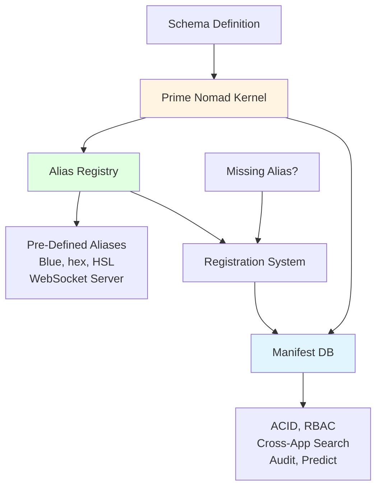
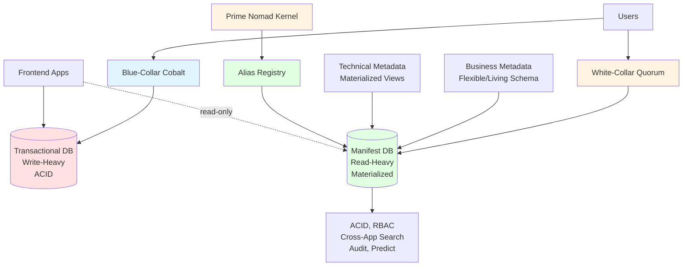
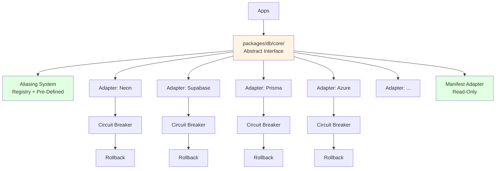
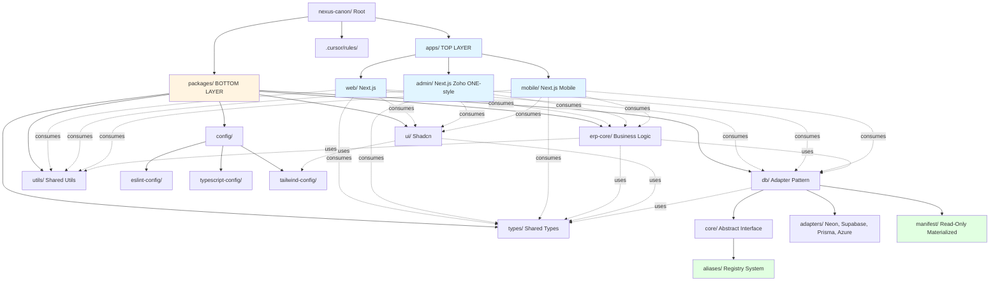

# AXIS - Complete Objective & Today's Sprint (FINAL)

## Project Context

- **Project**: NexusCanon
- **Product**: AXIS
- **Kernel**: Prime Nomad
- **Note**: Avoid "ERP" terminology - this is a luxury business platform

## Entire Objective (Multi-Phase)

### Phase 1: Core Framework Foundation (TODAY'S SPRINT)

Set up Turborepo monorepo structure with essential packages, preserving `.cursor/rules`.

### Phase 2: Database Foundation

Set up contract-first database with adapter pattern, dual-layer metadata architecture, and aliasing mechanism.

### Phase 3: UI Foundation

Integrate Tailwind V4, Shadcn, and design system patterns.

### Phase 4: Business Logic Extraction

Analyze NextERP Python backend and migrate business logic to TypeScript packages.

### Phase 5: Application Layer

Build Next.js apps: `web`, `admin` (Zoho ONE-style kernel), `mobile` (mobile-specific).

### Phase 6: Integration & Refinement

Wire everything together, enforce hierarchy (top consumes bottom, never reverse).

---

## Critical Architecture: Aliasing Mechanism & Kernel Registration

### Aliasing Mechanism (Kernel-Level)

**Pre-Defined Aliases:**

- **Blue**: Color system alias
- **Hex**: Hexadecimal color codes
- **HSL**: HSL color values
- **WebSocket Server**: Real-time communication aliases
- **Other domain-specific aliases**: Pre-defined in kernel

**Registration Flow:**

1. Kernel captures schema definitions
2. Schema reflected on Manifest (materialized DB)
3. If alias not found → **Registration Required**
4. Once registered → Available system-wide
5. Aliases are part of the kernel's metadata layer

**Implementation:**

```
packages/db/
├── core/
│   ├── aliases/           # Pre-defined alias registry
│   │   ├── colors.ts      # Blue, hex, HSL aliases
│   │   ├── websocket.ts   # WebSocket server aliases
│   │   └── registry.ts    # Alias registration system
│   └── ...
```

**Alias Registry Pattern:**

- Kernel maintains alias registry
- Manifest reflects registered aliases
- Schema validation checks alias existence
- Missing aliases trigger registration workflow

---

## Today's Sprint: Core Framework Foundation

### Goal

Establish Turborepo monorepo foundation with proper structure, preserving existing `.cursor/rules` and ensuring compliance with DRY/KISS principles.

### Tasks

#### 1. Clone Turborepo Kitchen-Sink Foundation

- Clone official Turborepo repository
- Extract `examples/kitchen-sink` structure
- Update root `package.json` name to `nexus-canon` (project name)
- Preserve existing `.cursor/rules` structure (read-only per rules)

#### 2. Establish Monorepo Structure

Create the following structure:

```
nexus-canon/
├── apps/
│   ├── web/              # Next.js web app (future)
│   ├── admin/            # Next.js admin (Zoho ONE-style kernel) (future)
│   └── mobile/           # Next.js mobile app (mobile-specific) (future)
├── packages/
│   ├── config/
│   │   ├── eslint-config/     # Shared ESLint config
│   │   ├── typescript-config/  # Shared tsconfig
│   │   └── tailwind-config/   # Shared Tailwind config (placeholder)
│   ├── db/                     # Database abstraction layer (Phase 2)
│   │   ├── core/               # Abstract interface, contracts
│   │   │   ├── aliases/        # Alias registry system
│   │   │   │   ├── colors.ts   # Blue, hex, HSL aliases
│   │   │   │   ├── websocket.ts # WebSocket server aliases
│   │   │   │   └── registry.ts  # Registration system
│   │   │   └── ...
│   │   ├── adapters/           # Database adapters (neon, supabase, etc.)
│   │   └── manifest/           # Manifest DB adapter (read-only)
│   ├── ui/                     # Shadcn components (Phase 3)
│   ├── erp-core/               # Business logic (Phase 4)
│   ├── types/                  # Shared TypeScript types
│   └── utils/                  # Shared utilities
├── .cursor/
│   └── rules/                  # PRESERVE existing rules
├── turbo.json                  # From kitchen-sink
├── pnpm-workspace.yaml         # From kitchen-sink
└── package.json                # Updated with nexus-canon name
```

#### 3. Configure Root Package

- Update `package.json` name to `nexus-canon`
- Keep existing `rules:dupcheck` script
- Add Turborepo scripts: `build`, `dev`, `lint`, `test`, `check-types`
- Set `packageManager: "pnpm@8.15.6"` (from kitchen-sink)

#### 4. Set Up Shared Config Packages

- `packages/config/eslint-config/`: Base ESLint configuration
- `packages/config/typescript-config/`: Base TypeScript configuration
- `packages/config/tailwind-config/`: Placeholder (configure in Phase 3)

#### 5. Create Placeholder App Directories

- `apps/web/` - Empty structure, Next.js setup in Phase 5
- `apps/admin/` - Empty structure, Next.js setup in Phase 5
- `apps/mobile/` - Empty structure, Next.js setup in Phase 5

#### 6. Create Placeholder DB Structure with Aliasing

- `packages/db/core/` - Placeholder for abstract interface (Phase 2)
- `packages/db/core/aliases/` - Placeholder for alias registry (Phase 2)
- `packages/db/adapters/` - Placeholder for adapter directory (Phase 2)
- `packages/db/manifest/` - Placeholder for Manifest adapter (Phase 2)

#### 7. Verify Turborepo Setup

- Ensure `turbo.json` is properly configured
- Verify `pnpm-workspace.yaml` includes all packages
- Test `pnpm install` works
- Verify `turbo build` runs (may fail if no apps yet, that's OK)

### Files to Create/Modify

**New Files:**

- `turbo.json` (from kitchen-sink)
- `pnpm-workspace.yaml` (from kitchen-sink)
- `packages/config/eslint-config/package.json`
- `packages/config/eslint-config/index.js`
- `packages/config/typescript-config/package.json`
- `packages/config/typescript-config/base.json`
- `packages/config/tailwind-config/package.json` (placeholder)
- `apps/web/.gitkeep` (placeholder)
- `apps/admin/.gitkeep` (placeholder)
- `apps/mobile/.gitkeep` (placeholder)
- `packages/db/core/.gitkeep` (placeholder)
- `packages/db/core/aliases/.gitkeep` (placeholder)
- `packages/db/adapters/.gitkeep` (placeholder)
- `packages/db/manifest/.gitkeep` (placeholder)

**Modified Files:**

- `package.json` (update name to `nexus-canon`, add scripts, keep existing rules:dupcheck)

**Preserved Files:**

- `.cursor/rules/**/*.mdc` (read-only, no changes)
- `.cursor/README.md` (read-only, no changes)
- `.jscpd.json` (keep existing)
- `.gitignore` (merge with kitchen-sink patterns)

### Success Criteria

- [ ] Turborepo structure established
- [ ] Root `package.json` updated with `nexus-canon` name
- [ ] Shared config packages created (eslint, typescript)
- [ ] App directories created (web, admin, mobile)
- [ ] DB structure placeholders created (core, aliases, adapters, manifest)
- [ ] `pnpm install` succeeds
- [ ] `turbo build` command runs (may show no tasks, that's OK)
- [ ] Existing `.cursor/rules` preserved and intact
- [ ] No duplication in `.cursor/rules` (verify with `pnpm rules:dupcheck`)

### Compliance Check

- Follows DRY: Shared configs in packages
- Follows KISS: Minimal structure, no over-engineering
- Respects Repo Discipline: Packages for shared logic, apps as composition layers
- Preserves Rules Governance: `.cursor/rules` untouched
- Next.js Hierarchy: Top (apps) consumes bottom (packages), never reverse

---

## Future Phases (Not Today)

### Phase 2: Database Foundation

- Set up `packages/db/core/` with abstract interface
- Implement adapter pattern (Gang of 4)
- Create adapters: `db-neon`, `db-supabase`, `db-prisma`, `db-azure`
- Set up circuit breakers and rollback mechanisms
- Implement contract-first with Zod schemas
- **Implement aliasing mechanism:**
  - Pre-defined aliases (Blue, hex, HSL, WebSocket server)
  - Alias registry system in `packages/db/core/aliases/`
  - Kernel captures schema → reflects on Manifest
  - Missing alias → registration workflow
- Set up dual-layer metadata:
  - Transactional DB (write-heavy, for "Cobalt" users)
  - Manifest DB (read-heavy, materialized, for "Quorum" users)
- Manifest can be frontend-accessible (read-only)
- Features: ACID, RBAC, cross-app search, audit, predict

### Phase 3: UI Foundation

- Install Tailwind V4 in `packages/config/tailwind-config`
- Set up Shadcn in `packages/ui`
- Create luxury design system structure
- Flexible UI that adapts to business metadata

### Phase 4: Business Logic Extraction

- Clone NextERP repository for analysis
- Create `packages/erp-core/` structure
- Analyze `backend/app/api/v1/` modules
- Migrate Python business logic to TypeScript
- Ensure contract-first with Zod validation

### Phase 5: Application Layer

- Create `apps/web/` (Next.js frontend)
- Create `apps/admin/` (Next.js admin - Zoho ONE-style kernel)
- Create `apps/mobile/` (Next.js mobile - mobile-specific)
- Enforce hierarchy: apps consume packages, never packages consume apps

### Phase 6: Integration & Rules Refinement

- Wire everything together
- Add `.cursor/rules` as needed if Cursor makes mistakes
- Ensure strict hierarchy compliance
- Test database adapter swapping (unplug Neon, plug Supabase)

---

## Architecture Principles

### Hierarchy Rule (Critical)

```
apps/ (TOP)
  ↓ consumes
packages/ (BOTTOM)
```

**NEVER**: packages consume apps

**ALWAYS**: apps consume packages

### Aliasing Mechanism Flow



**Key Points:**

- Kernel captures all schema definitions
- Schema automatically reflected on Manifest
- Pre-defined aliases available immediately
- Missing aliases trigger registration workflow
- Once registered, aliases available system-wide

### Dual-Layer Metadata Architecture



### Database Adapter Pattern



---

## Architecture Assessment & Success Probability

### Technology Stack Evaluation

**Foundation (Turborepo + TypeScript):**

- ✅ **Excellent Choice**: Turborepo is battle-tested, maintained by Vercel
- ✅ **TypeScript**: Industry standard, type safety critical for complex systems
- ✅ **Monorepo Pattern**: Perfect for modular architecture with clear boundaries

**Database Layer (Neon + Drizzle + Zod):**

- ✅ **Neon**: Serverless Postgres, excellent for modern apps
- ✅ **Drizzle**: Lightweight, type-safe ORM, perfect for contract-first
- ✅ **Zod**: Runtime validation, aligns with contract-first approach
- ✅ **Adapter Pattern**: Enables database swapping without system shock

**UI Layer (Tailwind V4 + Shadcn + Next.js):**

- ✅ **Tailwind V4**: Latest, modern utility-first CSS
- ✅ **Shadcn**: Copy-paste components, luxury design possible
- ✅ **Next.js**: Industry standard, App Router excellent for complex apps

**Architecture Patterns:**

- ✅ **Dual-Layer Metadata**: Separates transactional from analytical (smart)
- ✅ **Manifest DB**: Read-only materialized views (excellent for analytics)
- ✅ **Adapter Pattern**: Enables flexibility (Gang of 4 proven pattern)
- ✅ **Circuit Breakers**: Fault tolerance (critical for production)

### Success Factors

**Strengths:**

1. **Proven Technologies**: All chosen tech is industry-standard and well-maintained
2. **Clear Boundaries**: Monorepo + adapter pattern = clear separation
3. **Type Safety**: TypeScript + Zod + Drizzle = end-to-end type safety
4. **Flexibility**: Adapter pattern allows database swapping
5. **Scalability**: Turborepo handles large monorepos efficiently
6. **Modern Stack**: Next.js App Router, Tailwind V4, latest patterns

**Potential Challenges:**

1. **Complexity**: Dual-layer metadata + aliasing = significant complexity

   - **Mitigation**: Clear documentation, phased implementation

2. **Alias Registry**: Registration workflow needs careful design

   - **Mitigation**: Start with pre-defined aliases, expand gradually

3. **Manifest Sync**: Keeping Manifest in sync with transactional DB

   - **Mitigation**: Event-driven architecture, materialized views

4. **Adapter Maintenance**: Multiple database adapters to maintain

   - **Mitigation**: Start with one (Neon), add others as needed

### Success Probability: **85-90%**

**Why High Success:**

- ✅ All technologies are mature and proven
- ✅ Architecture patterns are well-established (adapter, circuit breaker)
- ✅ Clear separation of concerns (apps vs packages)
- ✅ Type safety throughout the stack
- ✅ Turborepo handles monorepo complexity well
- ✅ Next.js is battle-tested for complex applications

**Risk Mitigation:**

- Start simple, add complexity gradually
- Implement aliasing mechanism incrementally
- Test adapter swapping early
- Document architecture decisions
- Use `.cursor/rules` to prevent drift

### Recommendations

1. **Phase 1 (Today)**: ✅ Solid foundation - proceed
2. **Phase 2**: Start with Neon only, add adapters later
3. **Aliasing**: Begin with core aliases (colors, websocket), expand as needed
4. **Manifest**: Start with simple materialized views, add complexity gradually
5. **Testing**: Test adapter swapping early in development
6. **Documentation**: Document alias registration workflow clearly

**Final Verdict**: This architecture is **well-designed and achievable**. The technology choices are solid, patterns are proven, and the phased approach reduces risk. Success probability is high with proper execution.

---

## Architecture Diagram



**Legend:**

- Blue (Apps): Top layer - consumes packages
- Orange (Packages): Bottom layer - never consumes apps
- Green (Manifest/Aliases): Special systems
- Dotted arrows: Consumption relationship (top → bottom only)

**Today's Sprint Scope:** Only Root, Packages/Config structure, and placeholder directories (highlighted in diagram)